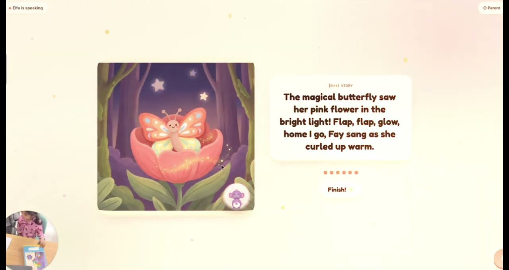
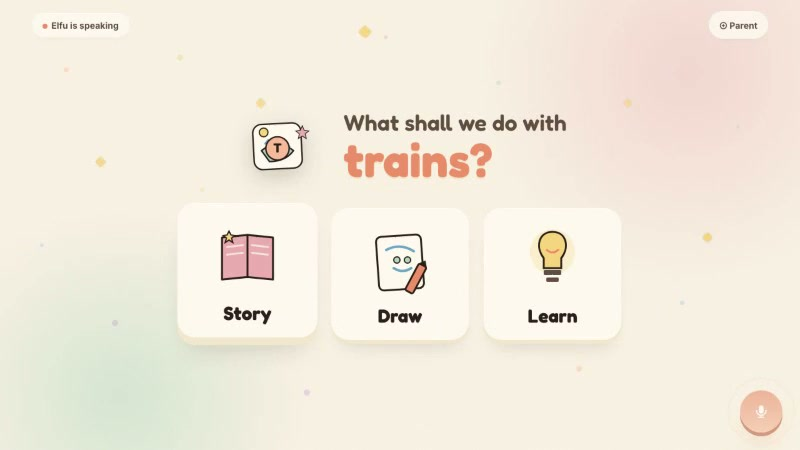
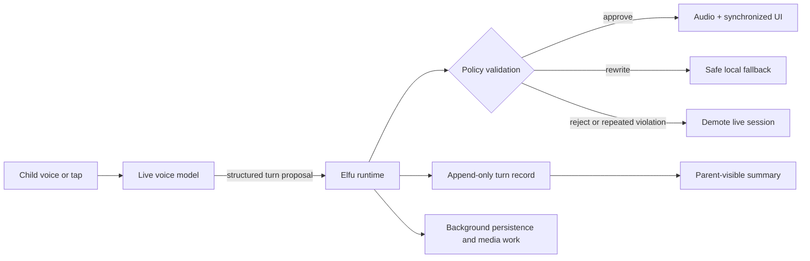

# Elfu

**A voice-first, safety-governed AI shell for curiosity, storytelling, drawing, and learning.**

**[Watch the two-minute demo →](https://youtu.be/eHUrM30v2EA)**

Elfu is a personal product and engineering experiment I built for my four-year-old. A child starts with a topic such as trains, butterflies, dinosaurs, or rain. Elfu, a baby-elephant guide, then offers three short paths: **Story**, **Draw**, or **Learn**.

I wanted to see whether a young child's first experience of AI could feel more like active creation and guided curiosity than another stream of passive content.

## Why this exists

For many parents, YouTube and Netflix are the easiest dependable options when a young child wants screen time. They work, but the child is mostly consuming. I could not find many substitutes that were active, curiosity-fostering, easy for a pre-reader to use, and safe enough for a parent to trust.

Elfu is an attempt at that missing interaction model. It is a bounded environment designed around how young children actually communicate, rather than a general chatbot with a child-friendly skin:

- voice before typing;
- large choices rather than open-ended navigation;
- short creative loops rather than an infinite feed;
- a warm guide without "best friend" framing;
- visible endings and parent handoff rather than engagement at any cost.

The bar I use is modest: **a better ten minutes than passive video: active, creative, finite, and parent-visible.**

## What a session feels like

1. The child says what they are curious about.
2. Elfu reflects the topic and offers **Story**, **Draw**, or **Learn**.
3. The child chooses with voice or a large on-screen card.
4. Elfu runs a short activity with limited steps and simple choices.
5. The session winds down and hands control back to a parent.

The current build is intentionally narrow. Story creates a short illustrated sequence. Draw gives one step at a time. Learn pairs a small fact with an action or question. The objective is not to keep the child talking indefinitely; it is to help them ask, choose, imagine, revise, and make something.

## Governed live-agent architecture

Native live voice models make conversation feel immediate, but they also create a control problem: a model can generate audio before application code has checked whether the content, state transition, and UI action are appropriate.

Elfu separates creative generation from authority. The model can propose the next turn; a deterministic runtime owns what the child actually hears and sees.

> **No child-facing audio plays unless the proposed turn has been validated and approved by the runtime.**

The runtime checks schema validity, stale turns, whether speech was directed to Elfu, dependency or secrecy language, state transitions, activity limits, session pacing, text length, and compatibility between the spoken response and requested UI.

This does not make a generative system perfectly safe. It changes the architecture so that safety, pacing, and workflow rules are enforced outside the model rather than left entirely inside a prompt.

Read the public technical overview: **[Governed live-agent architecture](docs/governed-agent-architecture.md)**.

## Safety and parent trust

Several product choices are deliberately restrictive:

- **Bounded activities, not open chat.** The child moves through explicit activity states with small turn budgets.
- **Tool framing, not simulated friendship.** Elfu can be warm and playful, but dependency-cultivating and secrecy-fostering language is rejected.
- **The runtime owns state.** The model cannot independently decide what screen is shown or whether an activity is complete.
- **Finite sessions.** The system can wind down based on time and turn limits and transition to a parent handoff.
- **Reviewable behavior.** Approved and rejected proposals are recorded so failures can be inspected after a session.
- **No open internet surface.** The child interacts inside the activity shell rather than navigating the web.

These are design constraints, not a claim that the current prototype is ready for unsupervised or broad consumer use.

## Testing a voice product with Robo-Kid

Voice-agent failures often live between components: an interruption arrives while audio is draining; the right words appear with the wrong screen; a session does not actually terminate; latency is hidden by an incomplete measurement; or an evaluator scores a broken recording as if it were a product failure.

I built a **Robo-Kid harness** to test the full interaction rather than only individual functions. A second live voice agent plays a child persona from a small scenario card and interacts with the real Elfu application through synthetic microphone audio.

For each run, the harness records:

- the exact scenario;
- synchronized product video and both sides of the audio;
- turn, state, interruption, and completion events;
- child-to-Elfu response timing;
- deterministic instrument-health checks;
- deterministic usability monitors;
- an optional model-based audiovisual evaluation.

The evaluator is tested too. Seeded defects such as repeated fallbacks, topic drift, duplicate audio, injected latency, and audio/visual desynchronization are used to check which failure classes the judge can reliably identify. A judge result is not treated as ground truth simply because it came from another model.

Read more: **[Robo-Kid evaluation harness](docs/robo-kid-evaluation-harness.md)**.

## Selected artifacts

| Artifact | What it shows |
| --- | --- |
| [Child demo](https://youtu.be/eHUrM30v2EA) | The product being used naturally by the child it was built for. |
| [Governed architecture](docs/governed-agent-architecture.md) | How live generation is separated from child-facing authority. |
| [Robo-Kid harness](docs/robo-kid-evaluation-harness.md) | The end-to-end test and recording methodology. |
| [Sanitized sample run](artifacts/sample-run/README.md) | A cooperative story scenario, aggregate timing, completion, and recording-health evidence. |
| [Evaluator calibration](artifacts/evaluator-calibration.md) | A historical seeded-defect exercise, including blind spots and confounded evidence. |

## Current scope

Elfu is a tinker project, not a released product. The current evidence comes from use with one young child, automated tests, and simulated voice sessions. The prototype still has important open problems, including conversational latency, broader scenario coverage, evaluator reliability, parent controls, privacy design, and testing across children, accents, ages, and environments.

The repository contains documentation and selected sanitized artifacts. The production application, complete prompts and policies, raw child data, and harness source are intentionally not included.

## Future direction

Two directions matter if the project continues:

- **Privacy-preserving memory:** enough continuity to remember a child's interests, creations, and progression without building an opaque archive of intimate conversations. Memory should be minimal, parent-controlled, inspectable, and erasable.
- **Personalized, age-guided progression:** adapt the interaction model as the child grows. At ages three to four that means voice, cards, pretend play, and drawing prompts. Later it can include phonics, sequencing, projects, typing, coding, research, and critical AI collaboration.

The long-term idea is an AI-native first-computer environment where children learn to ask, create, explain, imagine, and explore, with AI as a bounded tool rather than an authority or substitute relationship.

---

Built by [Aravind](https://github.com/aravind10x) as a personal exploration in child-computer interaction, governed agents, and evaluation for live voice systems.
