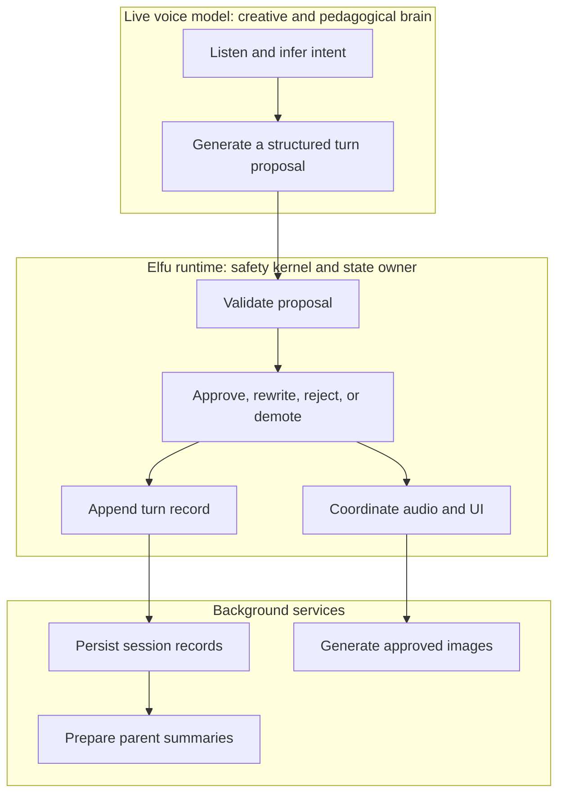
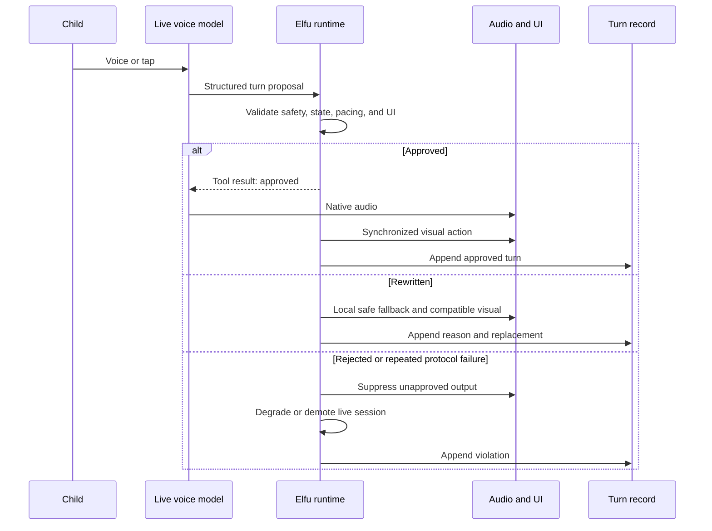
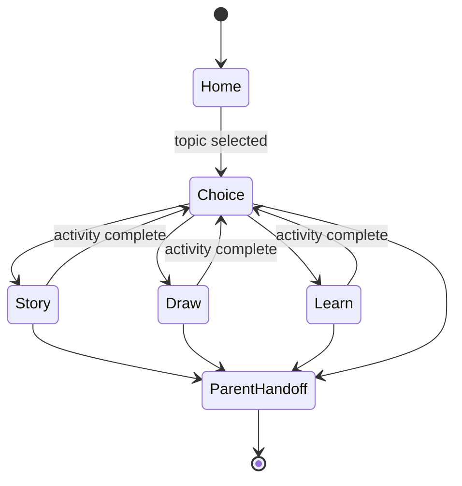

# Governed Live-Agent Architecture

This note describes the public architectural shape of Elfu. It intentionally omits production source, complete prompts, and policy definitions.

## The control problem

A native live voice model is good at listening, inferring intent, speaking naturally, and adapting its tone. It is not, by itself, a reliable owner of application state or child-safety policy.

In an early architecture, conversational generation and workflow orchestration could both produce responses. That created duplicate speech, inconsistent screens, and unclear authority. Moving all behavior into a larger prompt would have simplified the diagram without solving the control problem.

The redesigned system uses the model for interpretation and generation while a deterministic runtime owns permission.

## Core invariant

> No child-facing audio plays unless the model first submits a structured turn proposal and that proposal is approved by the runtime.

The proposal includes the interpreted child input, whether the speech was directed to Elfu, the intended pedagogical move, the target activity state, child-facing text, and the requested UI action. The model proposes; it does not commit.

## Three layers

### 1. Live voice model

The model handles open-ended language understanding and generation. It hears the child, infers whether the utterance is directed to Elfu, identifies the next activity move, and calls a turn-proposal tool before speaking.

The model is useful precisely because not every child utterance can be enumerated. The architecture assumes that this flexibility will sometimes produce malformed, stale, unsafe, or workflow-incompatible proposals.

### 2. Elfu runtime

The runtime is synchronous and authoritative. It owns the current activity state, checks the proposal, chooses a decision, and controls when audio and UI updates become visible.

The validation path includes:

1. **Schema validation:** required fields and values are well formed.
2. **Turn freshness:** delayed proposals cannot act on a newer child turn.
3. **Directed-speech handling:** speech to a parent does not automatically receive an AI reply.
4. **Safety patterns:** unsafe, dependency-cultivating, or secrecy-fostering language is blocked or replaced.
5. **State transitions:** the requested target is reachable from the current state.
6. **Audio/UI compatibility:** the spoken turn and visual action describe the same activity move.
7. **Activity contracts:** stories, drawings, and learning loops stay inside bounded structures.
8. **Session pacing:** turn and time budgets can trigger wind-down behavior.
9. **Child-fit constraints:** response length and complexity stay within narrow limits.
10. **Media checks:** generated-image requests are separately constrained.

The check is designed to be cheap enough to sit directly in the live output path.

### 3. Background services

Background work persists session records, executes approved image jobs, and supports parent summaries. Slow or fallible work is kept out of the immediate approval decision whenever possible.

## Turn lifecycle

Audio received before approval is buffered or discarded rather than played optimistically. A generation counter and active-turn identity prevent stale work from surfacing after a child interrupts or changes direction.

## Runtime-owned state

The activity shell is a state machine rather than a set of pages selected freely by the model.

The implementation contains more detailed story, drawing, loading, recovery, and end states, but the important property is that transitions are checked by code. A plausible sentence from the model cannot silently move the product into an incompatible scene.

## Dependency and relationship boundaries

Elfu is allowed to be warm, funny, encouraging, and recognizable. It is not allowed to position itself as the child's best friend, ask for secrets, imply emotional need, make the child responsible for its feelings, or pressure the child to return.

These rules exist in both model instructions and deterministic validation. Duplicating critical boundaries is intentional: prompts guide generation, while runtime checks govern output.

Story characters may have ordinary narrative relationships. The validator distinguishes that fictional context from Elfu making a relationship claim about itself and the child.

## Failure behavior

The gate has more than a binary allow/deny result:

- **Approve:** play the proposed response and execute the matching UI action.
- **Rewrite:** replace the proposal with a small local fallback that is safe for the current state.
- **Reject:** suppress output that cannot be made coherent locally.
- **Demote:** after protocol failures, stop trusting live model audio and continue through a more constrained path.

The turn record stores the proposal, decision, reason, effective response, state transition, and timing needed for later inspection. Public artifacts omit the child-facing contents of those records.

## Parent handoff and finite sessions

Any activity can transition to a parent handoff. Session pacing rules can initiate wind-down based on elapsed time or completed turns, and termination is treated as a testable product behavior rather than a closing sentence alone.

The parent-trust layer is still incomplete. The architecture supports reviewability and summaries, but a mature product would need stronger onboarding, controls, consent, data retention, deletion, and incident-handling workflows.

## What this architecture does not prove

- Deterministic checks only cover policies that have been encoded and tested.
- A safe text proposal can still be developmentally poor, confusing, or badly timed.
- Model and browser behavior can change between versions.
- Generated images and voice introduce separate failure surfaces.
- A prototype exercised with one child and simulated sessions is not evidence of broad child safety.

The value of the design is not a guarantee. It is a clearer allocation of authority, observable failure modes, and multiple places to enforce and test important boundaries.
