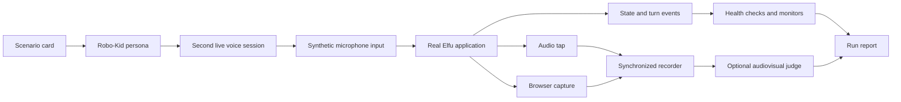

# Robo-Kid Evaluation Harness

The Robo-Kid harness is an end-to-end system for testing Elfu as a live voice product. This document describes the method and evidence model without publishing the harness source or raw session data.

## Why another test layer was necessary

Unit and browser tests can validate schemas, state transitions, buttons, and individual policies. They do not fully reproduce a child speaking into a microphone while a live model is generating audio and the application is changing screens.

Important failures cross those boundaries:

- Elfu speaks over the child after an interruption.
- audio is correct but the visible activity is stale;
- an activity says goodbye but does not actually terminate;
- a fallback repeats until the session becomes unusable;
- recorded audio drifts from the browser video;
- measured latency includes the wrong portion of the exchange;
- the evaluator reports a product issue when the recording instrument itself failed.

The harness treats the complete audiovisual session as the object under test.

## Session loop

A scenario card defines the topic, activity, temperament, interrupt behavior, and amount of off-script exploration. The card becomes a child persona for a second live voice agent. That agent listens to Elfu, responds through synthetic microphone audio, and follows the scenario without having direct access to product internals.

The driver observes explicit end-of-turn and interruption signals so the simulated child does not speak over audio that is still draining. Each run is bounded by time and completion conditions.

## Evidence captured per run

The private run directory contains several layers of evidence:

| Layer | Purpose |
| --- | --- |
| Scenario card | Records the exact behavior requested from Robo-Kid. |
| Session summary | Counts turns and exchanges, records completion, final scene, and response timing. |
| Instrument health | Checks timestamp order, latency completeness, A/V drift, duration consistency, and audio presence. |
| Deterministic monitors | Detects observable failures such as stale screens, display/speech mismatch, false completion, and excessive latency. |
| Synchronized recording | Provides the audiovisual object used for human or model review. |
| Turn record snapshot | Allows product decisions to be reconciled with what was heard and shown. |

Raw audio, video, transcripts, event streams, and turn records are intentionally not part of this public repository. The [sample run](../artifacts/sample-run/README.md) contains only sanitized aggregate outputs.

## Health before quality

A recorded run is not useful evidence merely because a file exists. The analysis first asks whether the instrument worked:

- Are event timestamps finite and monotonic?
- Is each completed exchange paired with a valid latency observation?
- Is rendered audio close to its scheduled playback time?
- Is residual audio/video drift inside the allowed bound?
- Does the recording duration agree with the session duration?
- Is Elfu audio present during spoken turns?
- Do event and summary counts reconcile?

If these checks fail, the run is marked unusable or rerun-worthy before interpreting quality. This prevents a recorder failure from being mistaken for a product failure.

## Deterministic monitors and model judging

Some failures have direct machine-checkable definitions. For example, the screen can be compared with the runtime's intended state, completion can be checked against the final scene, and timing can be calculated from captured clocks. These monitors should be preferred when they are authoritative.

Other qualities, including voice warmth, child fit, narrative coherence, delight, and how well Elfu responds to an unexpected child, are harder to encode. An optional multimodal judge watches the synchronized recording and returns structured findings plus diagnostic scores.

The judge is an observer, not an oracle. Its output is used alongside instrument health, deterministic monitors, product records, and human review.

## Testing the evaluator with seeded defects

Before trusting a model judge to detect a failure class, the harness can deliberately inject that failure into a live run. Current calibration targets include:

- repeated fallback loops;
- topic or theme drift;
- duplicate audio or turns;
- injected response latency;
- audio/visual desynchronization.

A classification is considered demonstrated only when the defect is present in usable evidence and the judge returns the expected structured category at the required severity and confidence. A valid run where the category is missed is recorded as a blind spot. A run where the stimulus or instrumentation cannot be established is recorded as confounded and is not silently counted as a pass or fail.

The historical calibration artifact in this repository is intentionally imperfect: it demonstrated one classification, found one judge blind spot, and left three defect classes confounded by mechanical evidence. That result changed how the harness is used. Deterministic monitors remain first-class, and new product work does not wait for a universal model-judge trust claim.

See **[Evaluator calibration](../artifacts/evaluator-calibration.md)**.

## Example run

The published sample is a cooperative train-story session:

- 2 minutes 31 seconds;
- four child/Elfu exchanges;
- completed in the parent-handoff scene;
- observed child-to-first-scheduled-audio latency between 1.40 and 2.30 seconds;
- all eleven instrument-health checks passed;
- no deterministic monitor findings in the aggregate report.

These numbers establish that this specific recording was internally coherent. They do not establish product quality across scenarios or children.

## Known limitations

- Robo-Kid is still another model, not a real child.
- A cooperative scripted persona does not cover the variance of preschool speech and behavior.
- Model judges can be coarse, inconsistent, or blind to important defects.
- Live evaluations cost money and can fail for network or provider reasons.
- Video-based review adds latency to the development loop.
- Scenario coverage and held-out evaluation need to grow without overfitting the product to the harness.

The harness is useful because it makes failures reproducible and evidence inspectable. It does not convert a difficult child-facing product into a single score.
